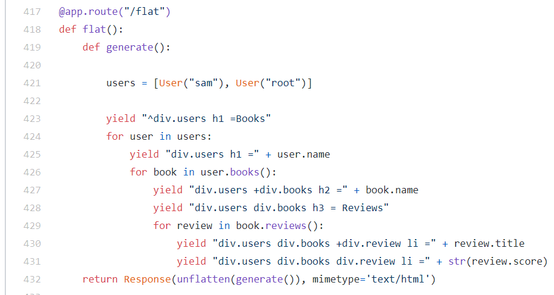
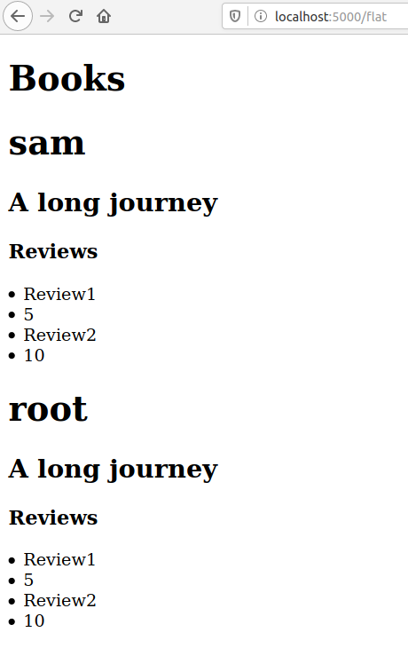

# flat-html

flat-html is an alternative to templating and helpful in debugging complicated HTML. You can use cursor tools of your text editor to rename classes in columns mode.

This repository renders HTML from a flatter representation of HTML that looks like this:

```
{
    "data": [
        "-div =My post",
        "-div.mesgs div.mesg_history div.incoming_msg_img img(src:https://ptetutorials.com/images/user-profile.png,alt:sam)",
        "div.mesgs div.mesg_history div.received_msg div.received_withd_msg p =My post",
        "div.mesgs div.mesg_history div.received_msg div.received_withd_msg span.time_date =time",
        "div.mesgs div.mesg_history div.received_msg span.blah =Mixed ",
        "div.mesgs div.mesg_history div.received_msg span.blah =elements ",
        "div.mesgs div.mesg_history div.received_msg b =go down a treat",
		
	"-div.mesgs div.mesg_history div.incoming_msg_img img(src:https://ptetutorials.com/images/user-profile.png,alt:sam)",
        "div.mesgs div.mesg_history div.received_msg div.received_withd_msg p =My post",
        "div.mesgs div.mesg_history div.received_msg div.received_withd_msg span.time_date =time",
        "div.mesgs div.mesg_history div.received_msg span.blah =Mixed ",
        "div.mesgs div.mesg_history div.received_msg span.blah =elements ",
        "div.mesgs div.mesg_history div.received_msg b =go down a treat"
		
    ]
}
```


It should generate HTML like this:

```
<div>
    <div>My post</div>
    <div class="mesgs">
        <div class="mesg_history">
            <div class="incoming_msg_img"></div>
            <div class="received_msg">
                <div class="received_withd_msg">
                    <p>My post</p><span class="time_date">time</span></div><span class="blah">Mixed </span><span class="blah">elements </span><b>go down a treat</b></div>
        </div>
    </div>
    <div class="mesgs">
        <div class="mesg_history">
            <div class="incoming_msg_img"></div>
            <div class="received_msg">
                <div class="received_withd_msg">
                    <p> My post</p><span class="time_date"> time</span></div><span class="blah"> Mixed </span><span class="blah"> elements </span><b> go down a treat</b></div>
        </div>
    </div>
</div>
```

# The ^ symbol

The ^ symbol is the shared parent operator. The following shares div.mesgs as a common parent.

```
{
    "data": [
        "-div =My post",
        "-div span = Name",
        "div input(type:text,name:name)",
        "-div span = Age",
        "div input(type:text,age)",
        "div button(type:submit) = Submit",
        "^div.mesgs div.mesg_history div.incoming_msg_img img(src:https://ptetutorials.com/images/user-profile.png,alt:sam)",
        "div.mesgs div.mesg_history div.received_msg div.received_withd_msg p =My post",
        "div.mesgs div.mesg_history div.received_msg div.received_withd_msg span.time_date =time",
        "div.mesgs div.mesg_history div.received_msg span.blah =Mixed ",
        "div.mesgs div.mesg_history div.received_msg span.blah =elements ",
        "div.mesgs div.mesg_history div.received_msg b =go down a treat",
        "^div.mesgs div.mesg_history div.incoming_msg_img img(src:https://ptetutorials.com/images/user-profile.png,alt:sam)",
        "div.mesgs div.mesg_history div.received_msg div.received_withd_msg p =My post",
        "div.mesgs div.mesg_history div.received_msg div.received_withd_msg span.time_date =time",
        "div.mesgs div.mesg_history div.received_msg span.blah =Mixed ",
        "div.mesgs div.mesg_history div.received_msg span.blah =elements ",
        "div.mesgs div.mesg_history div.received_msg b =go down a treat"
    ]
}
```

Generates the following HTML:

```
<div>
    <div>My post</div>
    <div><span> Name</span>
        <input type="text" name="name">
    </div>
    <div><span> Age</span>
        <input type="text" age="">
        <button type="submit"> Submit</button>
    </div>
    <div class="mesgs">
        <div class="mesg_history">
            <div class="incoming_msg_img"></div>
            <div class="received_msg">
                <div class="received_withd_msg">
                    <p>My post</p><span class="time_date">time</span></div><span class="blah">Mixed </span><span class="blah">elements </span><b>go down a treat</b></div>
        </div>
        <div class="mesg_history">
            <div class="incoming_msg_img"></div>
            <div class="received_msg">
                <div class="received_withd_msg">
                    <p>My post</p><span class="time_date">time</span></div><span class="blah">Mixed </span><span class="blah">elements </span><b>go down a treat</b></div>
        </div>
    </div>
</div>
```

# The new child operator (+ symbol)

The + symbol is the new child operator. It creates a new element from that point onwards. Note how div.review are new elements.

```
{
  "data": [
    "^div.users h1 =Books",
    "div.users h1 =sam",
    "div.users +div.books h2 =A long journey",
    "div.users div.books h3 = Reviews",
    "div.users div.books +div.review li =Review1",
    "div.users div.books div.review li =5",
    "div.users div.books +div.review li =Review2",
    "div.users div.books div.review li =10",
    "^div.users h1 =root",
    "div.users +div.books h2 =A long journey",
    "div.users div.books h3 = Reviews",
    "div.users div.books +div.review li =Review1",
    "div.users div.books div.review li =5",
    "div.users div.books +div.review li =Review2",
    "div.users div.books div.review li =10"
  ]
}
```

Generates the following HTML:

```
<div id="output">
    <div>
        <div class="users">
            <h1>Books</h1>
            <h1>sam</h1>
            <div class="books">
                <h2>A long journey</h2>
                <h3> Reviews</h3>
                <div class="review">
                    <li>Review1</li>
                    <li>5</li>
                </div>
                <div class="review">
                    <li>Review2</li>
                    <li>10</li>
                </div>
            </div>
            <h1>root</h1>
            <div class="books">
                <h2>A long journey</h2>
                <h3> Reviews</h3>
                <div class="review">
                    <li>Review1</li>
                    <li>5</li>
                </div>
                <div class="review">
                    <li>Review2</li>
                    <li>10</li>
                </div>
            </div>
        </div>
    </div>
</div>
```

# Usage

Open `flat-html.html` in your browser and give it a whirl. There's an editor at the top of the screen so you can see what your flat HTML is generating below.

# Service side usage

You can use flat html in a server. Here's a flask example. [Unflatten can be found here](https://github.com/samsquire/forum/blob/master/app.py#L243).



